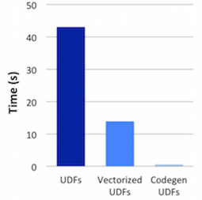

[](https://travis-ci.org/maropu/lljvm-translator)

This is an experimental translator to build JVM bytecode from LLVM bitcode.
Since some existing tools can generate LLVM bitcode from functions written in other languages
(e.g.,  [Numba](https://numba.pydata.org/) for python functions,
[clang](https://clang.llvm.org/) for C/C++ functions, and [DragonEgg](https://dragonegg.llvm.org/) for Fortran/Go functions),
this library targets at easily injecting the bitcode into JVMs.

## Python functions to JVM class methods

First, you need to install `Numba` to generate LLVM bitcode from python functions:

    $ pip install numba

You run code blow to get LLVM bitcode for a python function:

```python
import math

from numba import cfunc

def pyfunc(x, y):
  return math.log10(2 * x) + y

# Compiles the python function above and writes as LLVM bitcode
with open("pyfunc.bc", "wb") as out:
  f = cfunc("float64(float64, float64)")(pyfunc)
  out.write(f._library._final_module.as_bitcode())
```

Finally, you get a JVM class file for `plus`:

    $ ./bin/lljvm-translator ./pyfunc.bc

To check gen'd bytecode, you can use `javap`:

    $ javap -c -s pyfunc.class

```java
public final class GeneratedClass {
  ...
  public static double _cfunc__ZN8__main__10pyfunc_241Edd(double, double);
    descriptor: (DD)D
    Code:
       0: dconst_0
       1: dstore        4
       3: dconst_0
       4: dstore        6
       6: dconst_0
       7: dstore        8
       9: dload_0
      10: ldc2_w        #26                 // double 2.0d
      13: dmul
      14: dstore        4
      16: dload         4
      18: invokestatic  #8                  // Method java/lang/Math.log10:(D)D
      21: dstore        6
      23: dload         6
      25: dload_2
      26: dadd
      27: dstore        8
      29: dload         8
      31: dreturn
}
```

You can load this gen'd class file by the code below and run in JVMs:

```java
import java.lang.reflect.Method;

import maropu.lljvm.LLJVMClassLoader;

public class LLJVMTest {

  public static void main(String[] args) {
    try {
      Class<?> clazz = (new LLJVMClassLoader()).loadClassFromBytecodeFile("GeneratedClass", "pyfunc.class");
      Method pyfunc = clazz.getMethod("_cfunc__ZN8__main__10pyfunc_241Edd", Double.TYPE, Double.TYPE);
      System.out.println(pyfunc.invoke(null, 3, 6));
    } catch (Exception e) {
      e.printStackTrace();
    }
  }
}
```

## For C/C++ functions

You can use `clang` to get LLVM bitcode for C/C++ functions:

    $ cat cfunc.c
    #include <math.h>
    double cfunc(double a, double b) {
      return pow(3.0 * a, 2.0) + 4.0 * b;
    }

    $ clang -c -O2 -emit-llvm -o cfunc.bc cfunc.c
    $ ./bin/lljvm-translator ./cfunc.bc

Then, you dump gen'd bytecode:

    $ javap -c cfunc.class

```java
public final class GeneratedClass {
  ...
  public static double __Z5cfuncdd(double, double);
    descriptor: (DD)D
    Code:
       0: dconst_0
       1: dstore        4
       3: dconst_0
       4: dstore        6
       6: dconst_0
       7: dstore        8
       9: dconst_0
      10: dstore        10
      12: dload_0
      13: ldc2_w        #8                  // double 3.0d
      16: dmul
      17: dstore        4
      19: dload         4
      21: dload         4
      23: dmul
      24: dstore        6
      26: dload_2
      27: ldc2_w        #13                 // double 4.0d
      30: dmul
      31: dstore        8
      33: dload         6
      35: dload         8
      37: dadd
      38: dstore        10
      40: dload         10
      42: dreturn
}
```

## Example: inject python UDFs into Spark gen'd code

Python UDFs in [Spark](https://spark.apache.org/) have well-known overheads and the recent work of
[Vectorized UDFs](https://issues.apache.org/jira/browse/SPARK-21190) in the community
significantly improves the performance. But, Python UDFs still incur
[large performance gaps](https://gist.github.com/maropu/9f995f65b1cb160865e79e14e5216320) against Scala UDFs.
If we could safely inject python UDFs into Spark gen'd code, we would make the Python UDF overheads close to zero.
Here is [a sample patch](https://github.com/apache/spark/compare/master...maropu:LLJVMSpike) and
a quick benchmark below shows that the injection could make it around 50x faster than
the performance of the Vectorized UDFs:



## TODO

 * Fix many bugs in `lljvm-backend` and add tests
 * Add more platform-dependent binaries in `src/main/resources/native`
 * Make less dependencies in the native binaries
 * Register this library in the Maven Central Repository

## Bug reports

If you hit some bugs and requests, please leave some comments on [Issues](https://github.com/maropu/llvm-jdc/issues)
or Twitter([@maropu](http://twitter.com/#!/maropu)).

